<h1 align="center">👋 Hi, I’m Khush Vasudeo Patil</h1>
<h2 align="center">A Passionate IoT,Embedded Developer and Cybersecurity Enthusiast from India</h2>

- 🔭 I’m currently working on **Personal CyberSecurity, IoT & Embedded projects**
 
- 👀 I’m interested in **IoT,Embedded,BlockChain and Cybersecurity**

- 🌱 I’m currently learning **IoT, Embedded, Blockchain and Cloud Security**

- 👨‍💻 All of my projects are available at [https://github.com/AssassinK786](https://github.com/AssassinK786)

- 💞️ I’m looking to collaborate on **CyberSecurity, IoT & Embedded Projects**

- 📫 How to reach me at khushpatil01@gmail.com

GitHub Metrics

  
 

 

